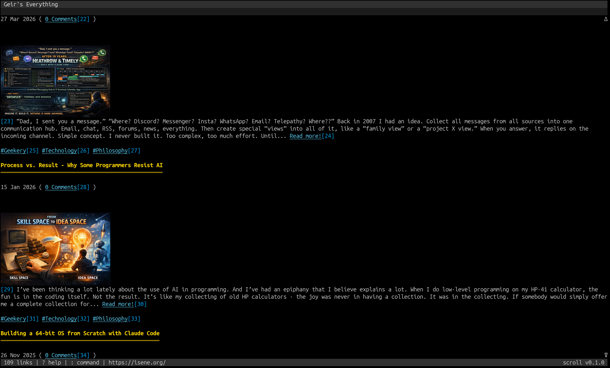
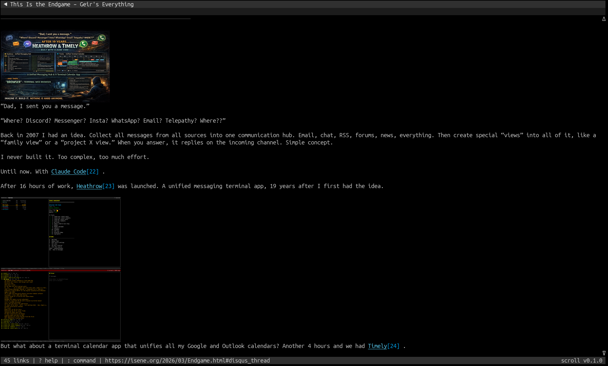

# Scroll - Terminal Web Browser



    

A keyboard-driven terminal web browser with inline image display, tabs, form handling, bookmarks, and AI page summaries. Vim-style keybindings. Feature clone of [brrowser](https://github.com/isene/brrowser).

Built on [crust](https://github.com/isene/crust) (TUI) and [glow](https://github.com/isene/glow) (images). Single binary, ~4.8MB.

<br clear="left"/>

## Quick Start

```bash
# Download from releases (Linux/macOS, x86_64/aarch64)
# Or build from source:
git clone https://github.com/isene/scroll
cd scroll
cargo build --release

# Browse a website
scroll isene.org

# Search
scroll g rust terminal browser

# Open local file
scroll file:///path/to/page.html
```

Press `?` for built-in help. Press `q` to quit.

---

## Screenshots

| Browsing with inline images | Reading an article |
|:---:|:---:|
|  |  |

---

## Key Features

- **HTML rendering**: Headings, paragraphs, lists, links, tables, code blocks, blockquotes, forms
- **Inline images**: Kitty graphics protocol, sixel, or ASCII art via chafa (auto-detected by [glow](https://github.com/isene/glow))
- **Tabs**: Create, close, undo close, cycle with J/K
- **Back/forward navigation**: Per-tab history with H/L keys
- **Forms**: Fill fields, auto-fill from stored passwords, submit via GET/POST
- **Bookmarks and quickmarks**: Save/recall with b/B and m/'/keys
- **Page search**: `/` to search, n/N for next/prev match
- **Link following**: TAB to cycle links (shown in reverse), ENTER to follow, or type link number
- **Site colors**: Extracts background/foreground from HTML/CSS, applies to content pane
- **Cookies**: Persistent cookie storage
- **AI summaries**: OpenAI GPT page summarization (I key)
- **Preferences**: Interactive popup (P key) with 20 configurable settings including colors
- **Search engines**: Google (g), DuckDuckGo (ddg), Wikipedia (w)
- **Downloads**: `:download URL` command
- **Clipboard**: Copy URL (y) or focused link (Y) via OSC 52

## Keyboard Reference

### Scrolling
| Key | Action |
|-----|--------|
| j/k, Down/Up | Scroll line |
| Space, PgDn/PgUp | Page down/up |
| gg | Go to top |
| G, End | Go to bottom |
| Ctrl-D/Ctrl-U | Half page down/up |
| </> | Scroll left/right |

### Navigation
| Key | Action |
|-----|--------|
| o | Open URL |
| O | Edit current URL |
| t | Open in new tab |
| H, Backspace | Go back |
| L, Delete | Go forward |
| r | Reload |

### Tabs
| Key | Action |
|-----|--------|
| J, Right | Next tab |
| K, Left | Previous tab |
| d | Close tab |
| u | Undo close |

### Links & Forms
| Key | Action |
|-----|--------|
| TAB / S-TAB | Cycle to next/prev link |
| ENTER | Follow focused link or enter link number |
| f | Fill and submit form |
| y | Copy page URL |
| Y | Copy focused link URL |

### Search & Bookmarks
| Key | Action |
|-----|--------|
| / | Search page |
| n / N | Next/prev match |
| b | Bookmark page |
| B | Show bookmarks |
| m + key | Set quickmark |
| ' + key | Go to quickmark |

### Other
| Key | Action |
|-----|--------|
| i | Toggle images |
| I | AI page summary |
| P | Preferences popup |
| Ctrl-L | Force redraw |
| : | Command mode |
| ? | Help |
| q | Quit |

### Commands
| Command | Action |
|---------|--------|
| `:open URL` / `:o URL` | Navigate |
| `:tabopen URL` / `:to URL` | Open in new tab |
| `:back` / `:forward` | History navigation |
| `:close` / `:q` | Close tab |
| `:quit` / `:qa` | Quit |
| `:reload` | Reload page |
| `:bookmark` / `:bm` | Bookmark current page |
| `:bookmarks` / `:bms` | List bookmarks |
| `:download URL` / `:dl URL` | Download file |
| `:help` | Show help |

## Configuration

Settings stored in `~/.scroll/`:
- `config.json` - All preferences (colors, homepage, search engine, image mode)
- `bookmarks.json` - Saved bookmarks
- `quickmarks.json` - Quick access marks (key to URL)
- `passwords.json` - Stored credentials (chmod 600)
- `cookies.json` - HTTP cookies

### Image Modes

| Mode | Method | Quality |
|------|--------|---------|
| `auto` | Best available (kitty > sixel > w3m > chafa) | Full color |
| `ascii` | chafa ASCII art | Text-based |
| `off` | No images | Fastest |

Change via Preferences (P key) or edit `config.json`.

## Dependencies

**Runtime** (optional, for full features):
- [chafa](https://hpjansson.org/chafa/) - ASCII art image fallback
- [ImageMagick](https://imagemagick.org/) (`convert`) - Image scaling for kitty/sixel
- `curl` - AI summary feature

## Part of the Fe2O3 Rust Terminal Suite

See the [Fe₂O₃ suite overview](https://github.com/isene/fe2o3) and the [landing page](https://isene.org/fe2o3/) for the full list of projects.

| Tool | Clones | Type |
|------|--------|------|
| [rush](https://github.com/isene/rush) | [rsh](https://github.com/isene/rsh) | Shell |
| [crust](https://github.com/isene/crust) | [rcurses](https://github.com/isene/rcurses) | TUI library |
| [glow](https://github.com/isene/glow) | [termpix](https://github.com/isene/termpix) | Image display |
| [plot](https://github.com/isene/plot) | [termchart](https://github.com/isene/termchart) | Charts |
| [pointer](https://github.com/isene/pointer) | [RTFM](https://github.com/isene/RTFM) | File manager |
| **[scroll](https://github.com/isene/scroll)** | **[brrowser](https://github.com/isene/brrowser)** | **Web browser** |
| [crush](https://github.com/isene/crush) | - | Rush config UI |

## License

[Unlicense](https://unlicense.org/) - public domain.

## Credits

Created by Geir Isene (https://isene.org) with extensive pair-programming with Claude Code.
